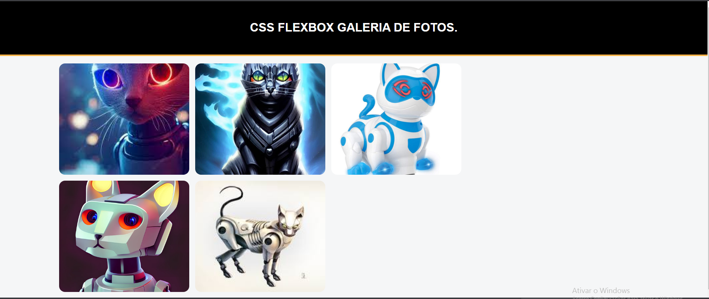

# Galeria de Fotos

Página  HTML e CSS com uso Flexbox

### ⌨️ Tela

## 📦 Website

<a href="https://i1iadeilton.github.io/galery-photos/">https://i1iadeilton.github.io/galery-photos/</a>

## 🛠️ Tecnologias e ferramentas usadas

Mencione as ferramentas que você usou para criar seu projeto

* [HTML](https://code.visualstudio.com/) - Linguagem de marcação de hipertexto.
* [CSS](https://code.visualstudio.com/) - Estilização
* [Visual Studio Code](https://code.visualstudio.com/) - Usada para gerar RSS

## 🖇️ Repositório

https://github.com/i1iadeilton/galery-photos

## ✒️ Autores

[Adeilton](https://github.com/i1iadeilton)

---
⌨️ com ❤️ por [Adeilton](https://github.com/i1iadeilton) 😊